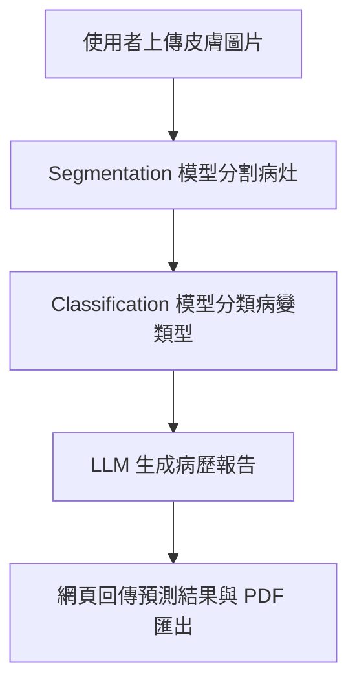

# 🔬 Skin Lesion Detection System（皮膚病變辨識系統）

本專題致力於建立一套可在 **Raspberry Pi** 上本地運行的智慧皮膚病變辨識系統，整合語意分割（Segmentation）、分類模型（CNN）與大型語言模型（LLM）生成病歷說明，協助非專科醫療場域進行快速初步診斷，同時兼顧資料隱私與實用性。

---

## 📌 專題動機與背景

皮膚癌與其他皮膚病變的早期診斷對提升病患預後至關重要。然而，多數偏鄉或基層醫療機構缺乏皮膚科醫師資源。本系統目標為：

- ✅ 使用者僅需透過手機上傳圖片，即可獲得病灶分割、分類與病歷說明
- ✅ 所有模型於 **樹莓派本地端執行**，避免隱私資料外洩
- ✅ 生成可下載的 PDF 病歷，便於後續醫療判讀與存檔

---

## 🧠 使用技術與架構

| 項目 | 說明 |
|------|------|
| **分割模型** | 使用 UNet 架構，針對皮膚影像自動標註病灶區域 |
| **分類模型** | Teacher: DenseNet201 / Student: MobileNetV2，使用知識蒸餾 |
| **部署技術** | 轉換為 TFLite 格式，於 Raspberry Pi 上運行 |
| **前端系統** | 使用 Django 架構簡易網頁 UI，支援手機端操作與圖片上傳 |
| **報告生成** | 使用 Groq 的 Llama3 模型生成繁體中文病歷說明 |
| **PDF 匯出** | 使用 WeasyPrint 將病歷與結果匯出為 PDF 文件 |
| **隱私設計** | 上傳影像不留存，於本地推論後即時顯示結果 |

---

## 🔁 系統流程圖



---

## 📷 系統截圖與結果（可選）

> 建議補上以下圖片說明專案亮點（可放入 images/ 資料夾）：

- ✅ Segmentation 標註效果圖
- ✅ 分類模型混淆矩陣
- ✅ 病歷報告 HTML 或 PDF 頁面範例

```markdown


```

---

## 🛠️ 安裝與執行方式

### 1️⃣ 安裝必要套件

```bash
pip install -r requirements.txt
```

> 若使用 Raspberry Pi，請先建立虛擬環境並啟動後再執行

---

### 2️⃣ 啟動 Django 網頁系統

```bash
cd webapp/skin_lesion
python manage.py migrate
python manage.py runserver 0.0.0.0:8000
```

在同一網路下的裝置（如手機）可透過：

```
http://<樹莓派IP>:8000
```

開啟網頁進行圖片上傳與推論。

---

## 📂 專案結構（簡化版）

```
skin-lesion-detection/
├── code/                    # 模型訓練程式（UNet, DenseNet, Student）
├── data/                    # 原始與處理後的影像資料集
├── models/                  # 訓練完成的 H5 模型與結果圖
├── webapp/skin_lesion/      # Django 專案（前後端 + 推論整合）
├── requirements.txt         # 套件需求
├── README.md                # 本說明文件
├── .gitignore               # Git 忽略設定
```

---

## 🎯 模型訓練與表現摘要

| 模型         | 準確率 (Accuracy) | 備註 |
|--------------|------------------|------|
| DenseNet201 (Teacher) | 71.2%             | 作為知識來源進行蒸餾 |
| MobileNetV2 (Student) | 69%             | 精簡版模型部署於 Raspberry Pi |
| UNet Segmentation     | IoU 約 0.85       | 使用 PH2 資料集訓練，病灶標註精準 |

> 📌 所有模型已轉為 `.tflite` 格式，支援 Raspberry Pi 本地推論

---

## 🔐 隱私與安全設計

- 所有模型皆於樹莓派本地推論執行，**不需網路上傳**
- 病歷報告使用 LLM 自動生成，僅供醫師輔助參考
- 上傳圖片不留存、不儲存

---

## 🔄 未來可擴充方向

- ✅ 支援相機即時取像 + YOLO 人臉偵測觸發推論
- ✅ 擴展分類為五類或更多疾病
- ✅ 病歷報告上傳至雲端 EMR 系統整合

---

## 👤 作者資訊

- 🧑‍💻 專題作者：林健勛  
- 🏫 所屬：國立中興大學 國際農企業學士學位學程  
- 📅 時間：2025 年  
- 💡 類型：嵌入式醫療 AI 專題  
- 🌐 訓練平台：Google Colab  
- 💻 部署平台：Raspberry Pi + Django + TFLite + Groq LLM

---


📣 若你對本專案有興趣、想要合作或改進，歡迎交流！


